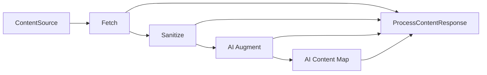

# zmapr Crate Design Specification

## Basic usage

`zmapr` maps local or website content into AI-oriented context through one public workflow function. Callers select stages with options, while stage ordering and artifact handling remain internal.
The function returns a running handle so callers can observe progress, query state, and await completion.

The initial usable workflow is local Fetch with optional Sanitize:

```rust
let handle = process_content(
    ProcessContentOptions::new("target/zmapr-docs")
        .with_fetch(LocalFetchRequest::new("docs"))
        .with_sanitize(SanitizeOptions::default()),
)
.await?;
let output = handle.wait_output().await?;
```

The public entry point is:

```rust
pub async fn process_content(
    options: ProcessContentOptions,
) -> Result<ProcessContentHandle>;
```

The returned handle keeps progress, completion, and state queries separate:

```rust
impl ProcessContentHandle {
    pub fn take_progress_rx(&mut self) -> Option<ProgressRx>;
    pub async fn wait_output(self) -> Result<ProcessContentOutput>;
    pub fn query(&self) -> ProcessQuery;
}
```

AI Augment is modeled by the public API but remains deferred. AI Content Map is implemented as described below.

## Architecture



The workflow executes selected stages in this fixed order. Disabled stages pass the current artifact set through unchanged, except that disabling Fetch requires a valid prior Fetch result.

## Sources

Sources identify where Fetch obtains content:

```rust
pub enum ContentSource {
    LocalPath(LocalContentSource),
    Web(WebContentSource),
}

pub struct LocalContentSource {
    pub path: SPath,
}

pub struct WebContentSource {
    pub url: String,
}
```

`ContentSource` remains public to represent sources abstractly, and is resolved when inspecting workflow contexts or loading prior manifests. Requests bind their specific source payload (`LocalContentSource` or `WebContentSource`) directly. Convenience constructors are provided through `ContentSource::local` and `ContentSource::web`, as well as `LocalFetchRequest::new` and `WebFetchRequest::new`.

## Workflow options

```rust
pub struct ProcessContentOptions {
    pub destination: SPath,
    pub fetch: Option<FetchRequest>,
    pub sanitize: Option<SanitizeOptions>,
    pub ai_augment: Option<AiAugmentOptions>,
    pub content_map: Option<ContentMapOptions>,
    pub resume: bool,
    pub max_concurrency: usize,
}
```

`ProcessContentOptions::new(destination)` creates an empty workflow. `with_fetch`, `with_sanitize`, `with_ai_augment`, and `with_content_map` enable individual stages without exposing pipeline construction.

An empty workflow is invalid. `max_concurrency` must be greater than zero.

## Stage options

### Fetch

```rust
pub enum FetchRequest {
    Local(LocalFetchRequest),
    Web(WebFetchRequest),
}

pub struct FetchCommonOptions {
    pub include: Vec<String>,
    pub exclude: Vec<String>,
}

pub struct LocalFetchRequest {
    pub source: LocalContentSource,
    pub common: FetchCommonOptions,
    pub options: LocalFetchOptions,
}

pub struct LocalFetchOptions {
    pub copy_local_files: bool,
}

pub struct WebFetchRequest {
    pub source: WebContentSource,
    pub common: FetchCommonOptions,
    pub options: WebFetchOptions,
}

pub struct WebFetchOptions {
    pub same_host_only: bool,
    pub follow_links: bool,
    pub max_depth: usize,
    pub llms: Option<bool>,
}
```

Fetch selects local files or crawls websites. Common include and exclude patterns are shared across sources: include patterns are applied before exclusions, exclusions take precedence, and selected paths are sorted by stable relative path. Local directory traversal is recursive and skips symbolic links.

For local sources, Fetch either copies files below `.tmp-zmapr/01-fetch/` or retains their original paths according to `copy_local_files`. It records source-relative paths and stable content hashes.

Website Fetch crawls from the starting URL, scoping candidate links to the starting URL base folder, and optionally following links while respecting `same_host_only` and `max_depth` settings. When `llms` is enabled, Fetch probes for an `llms.txt` file at the remote base folder URL before crawling. If `llms.txt` is discovered and contains valid entries, Fetch downloads the listed documents directly, mirroring the remote URL folder hierarchy locally and using the final URL path segment for the file name. If `llms.txt` is absent, empty, or unparseable, Fetch transparently falls back to regular HTML link crawling. In regular HTML crawling, scoped download paths without a file extension automatically receive a default `.html` extension.

### Sanitize

```rust
pub struct SanitizeOptions {
    pub slim_html: bool,
    pub convert_to_markdown: bool,
}
```

Sanitize reads supported UTF-8 text and HTML artifacts, optionally removes nonessential HTML structure, and optionally converts HTML to Markdown. It writes a new artifact set below `.tmp-zmapr/stages/sanitize` without changing Fetch artifacts or source files.

Unsupported or non-UTF-8 files are reported as skipped. Item-level transformation failures are retained in the response.

### AI Augment

```rust
pub struct AiAugmentOptions {
    pub provider: String,
    pub model: String,
}
```

AI Augment sends supported current artifacts to the configured provider and model, then writes augmented results below `.tmp-zmapr/stages/ai-augment`. Provider and model values must be nonempty.

### AI Content Map

```rust
pub struct ContentMapOptions {
    pub model: String,
    pub journal_path: Option<SPath>,
    pub reuse_unchanged_records: bool,
    pub retain_journal: bool,
    pub to_md: Option<bool>,
    pub max_size: Option<usize>,
    pub max_cost: Option<f64>,
}
```

AI Content Map prepares a separate copy of the artifacts received from its upstream stage under `.tmp-zmapr/02-map/` and analyzes that copy without changing source or upstream artifacts. Each artifact is copied when its item is processed, including items later skipped. When `to_md` is enabled, HTML is converted to Markdown and the prepared `.md` file is stored instead of an HTML copy. The published `<destination>/content-map.json` is the only content-map output; no `content-map.md` is published. The JSON includes per-file source modification time, source hash, prepared path, and prepared-content hash metadata. AI Content Map is terminal, so it does not replace the current content artifacts. File and folder analysis is journaled in an append-only NDJSON file (`.tmp-zmapr/content-map.journal.jsonl` or a custom `journal_path`) with immediate record flushes and crash recovery. File records identify the prepared relative paths in `02-map/` and use hashes of prepared content. Records are reusable when the journal header fingerprint (blake3 hash of model, prompt version, and artifact root) matches and the prepared input is unchanged. Valid journal entries are reconciled into a partial `content-map.json` before AI processing continues. On header or version mismatch, the journal is invalidated and rebuilt from scratch. When `retain_journal` is false, the journal is removed upon successful publication.

## Internal pipeline

The public function builds a private workflow context and executes internal stages through a shared asynchronous contract:

```rust
trait ProcessingStage {
    fn execute<'a>(
        &'a self,
        context: &'a WorkflowContext,
        input: ArtifactSet,
    ) -> StageFuture<'a>;
}
```

Internal types separate orchestration from public results:

- `WorkflowContext` contains resolved paths, resume settings, and concurrency limits.
- `ArtifactSet` identifies the current artifact root and ordered items.
- `ArtifactItem` stores source identity, relative path, local path, media type, and optional hash.
- `StageOutput` contains the next artifact set and item-level completed, skipped, and failed outcomes.

The pipeline module is private. Callers cannot define custom stages or alter stage ordering.

## Artifact layout

All generated state is rooted at the configured destination:

```text
<destination>/
├── .tmp-zmapr/
│   ├── 01-fetch/
│   ├── 02-map/
│   ├── stages/
│   │   ├── sanitize/
│   │   └── ai-augment/
│   ├── manifest.json
│   └── content-map.journal.jsonl
└── content-map.json
```

Each stage writes to its own location. Prior-stage artifacts remain immutable so downstream failures can be retried without mutating source content or successful upstream work.

## Validation and recovery

Validation occurs before destination mutation or stage execution. It checks:

- At least one stage is enabled.
- Concurrency is nonzero.
AI Augment has nonempty provider and model values, and Content Map has a nonempty model.
- Source path or web URL is structurally valid.
- Downstream processing without Fetch has a valid existing Fetch cache and manifest.
- Deferred stages return structured `Unsupported` errors.

The initial resume behavior may reuse only a complete matching Fetch result under `.tmp-zmapr/01-fetch/`. A Fetch run rebuilds legacy cache state rather than reusing artifacts from the old Fetch path. When Fetch is disabled, incompatible legacy cache state is rejected rather than treated as valid prior output. Missing, incompatible, or incomplete state is rebuilt rather than treated as reusable.

Durable publication should use deterministic serialization and atomic replacement. Temporary sibling files are written first, then renamed into their final locations.

## Results

`ProcessContentHandle::wait_output` returns the completed workflow data:

```rust
pub struct ProcessContentOutput {
    pub destination: SPath,
    pub manifest_path: Option<SPath>,
    pub content_root: SPath,
    pub content_map_path: Option<SPath>,
    pub completed_items: Vec<ProcessItem>,
    pub skipped_items: Vec<ProcessItem>,
    pub failures: Vec<ProcessFailure>,
}

pub struct ProcessItem {
    pub source: String,
    pub output_path: Option<SPath>,
    pub stage: ProcessStage,
}

pub struct ProcessFailure {
    pub item: ProcessItem,
    pub message: String,
}
```

`ProcessItem` identifies successful or skipped work. `ProcessFailure` preserves item-level errors without hiding successful work from the same stage.

## Content-map contract

```rust
pub struct ContentMapDocument {
    pub version: u32,
    pub model: String,
    pub prompt_version: u32,
    pub generated_at: String,
    pub file_map: BTreeMap<String, FileMapEntry>,
    pub folder_map: BTreeMap<String, FolderMapEntry>,
}

pub struct ContentMap {
    pub file_map: BTreeMap<String, FileMapEntry>,
    pub folder_map: BTreeMap<String, FolderMapEntry>,
}

pub struct FileMapEntry {
    pub summary: String,
    pub when_to_use: String,
    pub public_types: Vec<String>,
    pub public_functions: Vec<String>,
    pub topics: Vec<String>,
}

pub struct FolderMapEntry {
    pub summary: String,
    pub when_to_use: String,
    pub topics: Vec<String>,
}

pub struct FileMapMetadata {
    pub last_modified_unix_nanos: Option<u64>,
    pub source_hash: String,
    pub prepared_path: String,
    pub prepared_hash: String,
}
```

The serialized document `content-map.json` contains a provenance header (`version`, `model`, `prompt_version`, `generated_at`) alongside `file_map`, `folder_map`, and `file_metadata`. `file_map` indexes source-relative file paths to their summaries, usage guidance, public symbols, and topics. `file_metadata` records source timestamps and hashes together with the prepared mapper path and prepared-content hash. `folder_map` is currently emitted as an empty map for future folder summaries. Folder entries intentionally do not include code-specific public type or function fields. The only published map is `<destination>/content-map.json`.

## Errors

The crate exposes one `Result<T>` alias and a structured `Error` enum. Process failures distinguish:

- `InvalidConfiguration`, for incompatible options or sources.
- `Unsupported`, for modeled but unimplemented functionality.
- `InvalidCache`, for missing or invalid prior artifacts.
- `MalformedState`, for missing or invalid durable workflow state.

External I/O and HTTP failures are represented by dedicated error variants. Production paths do not panic for expected workflow failures.

## Implementation scope

The first complete vertical slice is:

- Local file and recursive directory Fetch.
- Symbolic-link skipping.
- Deterministic include and exclude selection.
- Optional copying into the Fetch cache.
- Stable source hashes.
- Website Fetch with URL base folder scoping, link extraction, and depth limits.
- Website Fetch with `llms.txt` discovery, link parsing, and automatic HTML fallback.
- Optional UTF-8 text and HTML Sanitize.
- Fetch-only and Fetch-plus-Sanitize responses.
- AI Content Map stage generating `content-map.json` with NDJSON journal reuse.
- Structured errors for the deferred AI Augment stage.

The public contracts for Website Fetch, AI Augment, manifests, journals, and complete resume behavior are established before their full execution is implemented.

## Module boundaries

The crate root reexports the public error and process APIs. The `process` module owns public workflow types and privately contains pipeline implementation details, while `mapr` houses the content mapping engine:

```text
src/
├── lib.rs
├── error.rs
├── mapr/
│   ├── mod.rs
│   ├── content-map.tmpl
│   ├── mapr_ai.rs
│   ├── mapr_impl.rs
│   ├── mapr_journal.rs
│   ├── mapr_prompt.rs
│   ├── mapr_types.rs
│   └── support.rs
├── process/
│   ├── mod.rs
│   ├── options/
│   ├── pipeline.rs
│   ├── process_impl.rs
│   ├── response.rs
└── webc/
```

Public models remain focused in their own files. Internal stage contracts stay private so the high-level workflow remains stable while stage implementations evolve.

