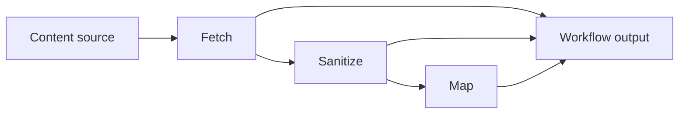

# zmapr Crate Design Specification

## Basic usage

`zmapr` maps local or website content into AI-oriented context through one workflow function. The workflow runs the selected stages in a fixed order: Fetch, Sanitize, then Map. The returned handle lets callers observe progress, query state, and await the final output.

Fetch only, using `FetchFormat::Md` (Markdown) as the default format:

```rust
ProcessContentOptions::new("target/zmapr-docs")
    .with_source("https://example.com/docs");
```

Fetch and Map:

```rust
ProcessContentOptions::new("target/zmapr-docs")
    .with_source("docs")
    .with_map(true)
    .with_model("gpt-5-mini");
```

Fetch, Sanitize, and Map with separate models and custom Sanitize instructions:

```rust
ProcessContentOptions::new("target/zmapr-docs")
    .with_source("https://example.com/docs")
    .with_max_depth(3)
    .with_sanitize(true)
    .with_map(true)
    .with_model("gpt-5")
    .with_sanitize_model("gpt-5-mini")
    .with_sanitize_prompt(SanitizePrompt::file("prompts/sanitize.md"));
```

Map an existing Fetch cache:

```rust
ProcessContentOptions::new("target/zmapr-docs")
    .with_map(true)
    .with_model("gpt-5-mini")
    .with_resume(true);
```

The public entry point is:

```rust
pub async fn process_content(
    options: ProcessContentOptions,
) -> Result<ProcessContentHandle>;
```

The returned handle separates progress, final output, and state queries:

```rust
impl ProcessContentHandle {
    pub fn take_progress_rx(&mut self) -> Option<ProgressRx>;
    pub async fn wait_output(self) -> Result<ProcessContentOutput>;
    pub fn query(&self) -> ProcessQuery;
}
```

`ProgressRx` is a single-consumer receiver. It provides these operations:

```rust
impl ProgressRx {
    pub async fn recv(&mut self) -> Result<ProgressUpdate>;
    pub fn is_disconnected(&self) -> bool;
}

pub struct ProgressUpdate {
    pub seq: u64,
    pub event: ProgressEvent,
    pub stats: ProgressStats,
}

pub enum ProgressEvent {
    StageStarted { stage: ProcessStage },
    StageCompleted { stage: ProcessStage },
    StageFailed { stage: ProcessStage, message: String },
    ItemsRegistered { stage: ProcessStage, count: usize },
    ItemsExcluded { stage: ProcessStage, count: usize },
    StageTotalKnown { stage: ProcessStage, total_items: usize },
    ItemStatusChanged { id: ItemId, stage: ProcessStage, status: ItemStatus },
    WorkflowCompleted,
    WorkflowFailed { message: String },
}
```

`ProcessQuery` provides authoritative live state independently of the progress receiver. Callers can read stage statistics, inspect items by run-scoped id or stored relative path, list ids by stage status, or request a point-in-time snapshot:

```rust
impl ProcessQuery {
    pub fn stats(&self) -> ProgressStats;
    pub fn item(&self, id: ItemId) -> Option<ItemState>;
    pub fn item_by_path(&self, relative_path: &str) -> Option<ItemState>;
    pub fn items(&self) -> Vec<ItemState>;
    pub fn item_ids(&self, stage: ProcessStage, status: ItemStatus) -> Vec<ItemId>;
    pub fn snapshot(&self) -> ProcessStateSnapshot;
}
```

## Architecture



Stages execute in the fixed order shown. A disabled stage passes the current artifact set through unchanged. When Fetch is disabled and Sanitize or Map is enabled, the workflow loads a valid prior Fetch result.

## Sources

Sources identify where Fetch obtains content:

```rust
pub enum ContentSource {
    LocalPath(LocalContentSource),
    Web(WebContentSource),
}

pub struct LocalContentSource {
    pub path: SPath,
}

pub struct WebContentSource {
    pub url: String,
}
```

`ContentSource` is the typed local or web source representation used by the workflow. Convenience constructors are provided through `ContentSource::local` and `ContentSource::web`, and `From` implementations accept the corresponding source types and `SPath`. The flat workflow options store a source as a local path or an HTTP(S) URL string.

## Workflow options

`ProcessContentOptions` configures all stages without exposing pipeline construction:

```rust
pub struct ProcessContentOptions {
    pub destination: SPath,
    pub source: Option<String>,
    pub include: Vec<String>,
    pub exclude: Vec<String>,
    pub format: FetchFormat,
    pub max_depth: usize,
    pub llms: bool,
    pub sanitize: bool,
    pub map: bool,
    pub model: Option<String>,
    pub sanitize_model: Option<String>,
    pub map_model: Option<String>,
    pub sanitize_prompt: Option<SanitizePrompt>,
    pub resume: bool,
    pub concurrency: usize,
}
```

`ProcessContentOptions::new(destination)` creates a workflow with optional stages disabled and no source selected.

Defaults are:

- `format` is `FetchFormat::Md`.
- `max_depth` is `0`.
- `llms` is `true`.
- `sanitize`, `map`, and `resume` are `false`.
- `concurrency` is `8`; it bounds concurrent item work in web Fetch, Sanitize, and Map. Local Fetch is sequential and does not use it.
- Optional model, source, and prompt fields are `None`.
- `include` and `exclude` are empty.

Builder methods are grouped by purpose:

- Fetch: `with_source`, `with_include`, `append_include`, `append_includes`, `with_exclude`, `append_exclude`, `append_excludes`, `with_format`, `with_max_depth`, and `with_llms`.
- AI stages: `with_sanitize`, `with_map`, `with_model`, `with_sanitize_model`, `with_map_model`, and `with_sanitize_prompt`.
- Workflow: `with_resume` and `with_concurrency`.

`FetchFormat` has `Raw`, `Slim`, and `Md` variants. `Md` is the default. `SanitizePrompt` has `FilePath(SPath)` and `Content(String)` variants, with `SanitizePrompt::file` and `SanitizePrompt::content` constructors.

The Sanitize model resolves from `sanitize_model`, then `model`. The Map model resolves from `map_model`, then `model`. Every enabled AI stage requires a nonempty resolved model. The default AI selector passes the resolved model to `genai`; an active selector can substitute a stub or custom client.

## Core stages

| Stage | Intent | Configuration |
|---|---|---|
| Fetch | Acquires local or web content and stores it in the Fetch cache. | Set `source`; configure selection patterns, format, crawl depth, and `llms`. |
| Sanitize | Uses an AI model to clean supported text while preserving substantive content. | Set `sanitize`; configure a model and, optionally, replacement instructions. |
| Map | Analyzes current artifacts and publishes a structured content map. | Set `map` and configure a model. |

## AI client selection

The crate exposes a client trait and selector for AI-backed stages. The default selector is `Real`; `Stub` provides deterministic responses, and `Custom` accepts an application-provided client. Processing uses the active selector, which can be set or reset with `set_active_ai_selector`.

```rust
pub type BoxFuture<'a, T> = Pin<Box<dyn Future<Output = T> + Send + 'a>>;

pub struct MaprAiResponse {
    pub content: String,
    pub usage: Option<genai::chat::Usage>,
}

pub trait MaprAiClient: Debug + Send + Sync {
    fn complete<'a>(&'a self, prompt: &'a str) -> BoxFuture<'a, crate::Result<MaprAiResponse>>;
}

pub enum MaprAiSelector {
    Real,
    Stub,
    Custom(Arc<dyn MaprAiClient>),
}

pub fn set_active_ai_selector(selector: Option<MaprAiSelector>);
pub fn get_active_ai_selector() -> MaprAiSelector;
pub fn select_ai_client(
    selector: Option<&MaprAiSelector>,
    model: &str,
) -> Arc<dyn MaprAiClient>;
pub fn select_active_ai_client(model: &str) -> Arc<dyn MaprAiClient>;
```

## Fetch

Local files and recursively selected directory files are copied into `.tmp-zmapr/01-fetch/`. Symbolic links are skipped. Local Fetch discovers, reads, formats, and writes selected items sequentially, and does not use `max_concurrency`.

Include patterns are applied before exclusions. Exclusions take precedence, and selected paths are sorted by stable relative path. Local and web sources use the same patterns.

The implemented matcher supports `*` within a path segment and `**` across zero or more path segments, rather than the full shell glob syntax. A leading `!` on an include pattern adds an exclusion; explicit exclude patterns are also exclusions.

Web crawling is scoped to the base folder of the starting URL. The starting resource is fetched at depth zero. Linked pages are discovered and fetched up to `max_depth`; a value of zero fetches only the starting resource. When `llms` is enabled, Fetch probes for `llms.txt` at the remote base folder. Valid entries are downloaded directly while preserving the URL folder hierarchy. If the file is absent, empty, or has no valid entries, Fetch falls back to regular HTML link crawling. Scoped paths without an extension receive a default `.html` extension during regular crawling.

Fetch formats HTML detected by media type or by the `.html`, `.htm`, or `.xhtml` extension. Other files are stored unchanged in every format.

- `Raw` stores HTML bytes as received.
- `Slim` slims HTML and keeps its path and media type.
- `Md` converts HTML to Markdown, replaces its extension with `.md`, and sets the media type to `text/markdown`.

Non-UTF-8 HTML and transformation errors are reported as item failures. Fetch detects duplicate stored paths and reports collisions as item-level failures rather than silently accepting the conflicting path.

The Fetch manifest is version 4. It records selection patterns and format, plus web crawl depth and `llms` settings for web sources. Each item records its stored relative path, original relative path, source content hash, and stored artifact hash. Prior Fetch loading supports local and web manifests and validates the cache root, artifact paths, and artifact hashes.

## Sanitize

Sanitize processes the current artifact set from Fetch or a prior Fetch cache. It sends supported UTF-8 text up to 200,000 bytes to the configured AI model. The built-in instructions remove navigation and boilerplate while preserving substantive content, add code fence language identifiers when determinable, normalize formatting, and prohibit invented content. A custom `SanitizePrompt` replaces the built-in instructions.

The engine adds the artifact's relative path, wraps the input in `<SANITIZE_INPUT>` tags, and asks the model to return cleaned content between `<SANITIZED_CONTENT>` tags. Missing output tags, model errors, and write errors are item failures.

Per-item model usage is attached to the successful `ItemStageState` and aggregated in the stage and workflow statistics.

When `resume` is enabled, Sanitize reuses an output only if the manifest's model and instruction hash match, the input hash is unchanged, and the output still matches its recorded hash. The version 1 manifest is stored at `.tmp-zmapr/sanitize-manifest.json`.

Pending items are processed with bounded scheduling: at most `concurrency` tasks are spawned at once, and a new task is spawned as each one finishes.

## Map

Map analyzes the artifacts from the preceding stage directly. It does not create a prepared copy or transform the artifacts. Map keys are the upstream relative paths, such as `index.md`, and Map is terminal: it does not replace the current content artifacts.

Pending items are processed with bounded scheduling: at most `concurrency` tasks are spawned at once, and a new task is spawned as each one finishes.

Map writes `<destination>/content-map.json`. The version 1 JSON document contains a provenance header, `file_map`, `folder_map`, and `file_metadata`. The internal per-file size limit is 200,000 bytes. The journal is version 1 NDJSON at `.tmp-zmapr/content-map.journal.jsonl`; it has a header followed by file or folder success and failure records, though current Map execution records files only. Appended lines are flushed. Its fingerprint includes the model, prompt version, and input artifact root. With `resume` enabled, file entries are reused when the journal header matches and the input path and hash match. Incompatible journal headers are invalidated. With resume disabled, entries are not reused; a failure-free run clears the journal after publishing the map, while item failures leave records retained. Per-item Map tasks currently ignore journal append errors, so those errors are not surfaced as Map item failures.

The versioned Map prompt (`PROMPT_VERSION` is currently 2) supplies a file path and content and requires a `<FILE_INFO>` block containing JSON fields for `summary`, `when_to_use`, `public_types`, `public_functions`, and `topics`. The list fields accept arrays or comma-separated strings. Missing fields default to empty values, and Markdown fences around the JSON are accepted. Topic normalization retains at most seven nonempty topics and truncates each to three words. Missing tags and malformed JSON become `MissingTag` and `MalformedResponse` item failures.

## Internal pipeline

The pipeline module is private. Internal types separate orchestration from public results:

- `WorkflowContext` contains resolved paths, resume settings, concurrency limits, and progress state.
- `ArtifactSet` identifies the current artifact root and ordered items.
- `ArtifactItem` stores source identity, relative path, local path, media type, and an optional hash.
- `StageOutput` contains the next artifact set and item-level completed, skipped, and failed outcomes.

Callers cannot define custom stages or alter stage ordering.

## Artifact layout

All generated state is rooted at the configured destination:

```text
<destination>/
├── .tmp-zmapr/
│   ├── 01-fetch/
│   ├── 02-sanitize/
│   ├── manifest.json
│   ├── sanitize-manifest.json
│   └── content-map.journal.jsonl
└── content-map.json
```

Fetch and Sanitize write to separate locations so downstream failures can be retried without mutating source files or successful upstream work.

## Validation and recovery

Request validation checks the workflow before stage execution:

- At least one of Fetch, Sanitize, or Map is enabled.
- `concurrency` is greater than zero.
- Every enabled AI stage resolves to a nonempty model.
- A local source exists and is a file or directory, or a web source is a structurally valid HTTP(S) URL.
- A Sanitize prompt file exists, and inline prompt content is nonempty.
- When Fetch is disabled and a downstream stage is enabled, a valid prior Fetch manifest and cache are required.

When resume is enabled, local Fetch may reuse a complete matching result when source, options, paths, and artifact hashes still match. Sanitize reuse additionally requires matching model, instructions, input hash, and output hash. Map reuse requires a matching journal fingerprint and unchanged artifact input. Missing, incompatible, or incomplete state is not treated as reusable.

Durable publication uses deterministic serialization and atomic replacement where applicable. Temporary sibling files are written first, then renamed into their final locations.

## Results

`ProcessContentHandle::wait_output` returns the completed workflow data:

```rust
pub struct ProcessContentOutput {
    pub destination: SPath,
    pub manifest_path: Option<SPath>,
    pub content_root: SPath,
    pub content_map_path: Option<SPath>,
    pub items: Vec<ItemState>,
    pub stats: FinalStats,
}


pub enum ProcessStage {
    Fetch,
    Sanitize,
    Map,
}
```

The item registry has one run-scoped id per item, reused across its selected stages. `relative_path` is the stored path shared by Fetch, Sanitize, and Map; `origin_path` preserves the discovered path before Fetch formatting. `content_path()` returns the Sanitize artifact path when present, otherwise the Fetch artifact path. Map does not produce a per-item path.

```rust
pub struct ItemState {
    pub id: ItemId,
    pub source: String,
    pub origin_path: String,
    pub relative_path: String,
    pub fetch: Option<ItemStageState>,
    pub sanitize: Option<ItemStageState>,
    pub map: Option<ItemStageState>,
}

pub struct ItemStageState {
    pub status: ItemStatus,
    pub path: Option<SPath>,
    pub usage: Option<genai::chat::Usage>,
    pub error: Option<String>,
}

pub enum ItemStatus {
    Pending,
    Running,
    Completed,
    Reused,
    Skipped,
    Failed,
}

pub struct ProcessStateSnapshot {
    pub stats: ProgressStats,
    pub items: Vec<ItemState>,
}
```

`ProgressStats` is the live view. Selected stages begin as `Pending`; unselected stages are `NotSelected`. A stage moves through `Running` to `Completed`, or becomes `Failed` when a workflow error occurs. Each `StageProgress` includes `total_items`, pending, running, completed, reused, skipped, failed, excluded, usage, and optional start and end times. `registered_items()` sums the item status counters and does not include excluded items.

`total_items` counts registered, selected items, including items that later fail. It remains `None` while web crawl discovery is in progress and is set when the total is known. Items excluded by selection patterns are not registered and do not count toward `total_items`; their count is reported separately in `excluded`. Web URLs fetched only to discover links are also counted as excluded when they are not selected.

```rust
pub enum StageStatus {
    NotSelected,
    Pending,
    Running,
    Completed,
    Failed,
}

pub struct ProgressStats {
    pub fetch: StageProgress,
    pub sanitize: StageProgress,
    pub map: StageProgress,
    pub total_usage: Option<genai::chat::Usage>,
    pub started_epoch_us: i64,
    pub ended_epoch_us: Option<i64>,
}

pub struct StageProgress {
    pub status: StageStatus,
    pub total_items: Option<usize>,
    pub pending: usize,
    pub running: usize,
    pub completed: usize,
    pub reused: usize,
    pub skipped: usize,
    pub failed: usize,
    pub excluded: usize,
    pub usage: Option<genai::chat::Usage>,
    pub started_epoch_us: Option<i64>,
    pub ended_epoch_us: Option<i64>,
}

pub struct FinalStats {
    pub fetch: Option<StageFinal>,
    pub sanitize: Option<StageFinal>,
    pub map: Option<StageFinal>,
    pub total_usage: Option<genai::chat::Usage>,
    pub started_epoch_us: i64,
    pub ended_epoch_us: i64,
}

pub struct StageFinal {
    pub total_items: usize,
    pub completed: usize,
    pub reused: usize,
    pub skipped: usize,
    pub failed: usize,
    pub excluded: usize,
    pub usage: Option<genai::chat::Usage>,
    pub started_epoch_us: i64,
    pub ended_epoch_us: i64,
}
```

`FinalStats` is created only after a successful workflow. Every selected stage must be completed, have no pending or running items, and satisfy `total_items == completed + reused + skipped + failed`; excluded items are not part of this total. Stage and workflow timestamps are epoch microseconds. `StageProgress::duration()`, `ProgressStats::duration()`, `StageFinal::duration()`, and `FinalStats::duration()` provide elapsed durations.

Item statuses describe the outcome at each stage. Fetch uses `Pending` while registered, `Running` while copying or downloading, `Completed` when an artifact is stored, `Reused` for a valid resume artifact, and `Failed` for a read, format, collision, write, or HTTP error. Sanitize uses `Skipped` when it copies an unsupported, oversized, or non-UTF-8 item unchanged. Map uses `Skipped` for an item that cannot be mapped. Sanitize and Map use `Reused` when their resume state is valid. `Failed` retains the item-level error without preventing successful items from being reported.

The output's `stats.total_usage` aggregates usage reported by completed AI items. Per-stage usage is accumulated alongside it.

Progress notifications carry `ProgressUpdate { seq, event, stats }`. `ProgressEvent` reports stage starts and completions, item registration and status changes, exclusions, and workflow completion or failure. The sequence increases for every recorded update, so gaps reveal dropped notifications. Each update's statistics snapshot is captured under the same lock as its event. Notifications are observational and may be dropped when the bounded channel is full; `ProcessQuery` and `ProcessStateSnapshot` remain authoritative and expose the live statistics and item registry.

## Content-map contract

```rust
pub struct ContentMapDocument {
    pub version: u32,
    pub model: String,
    pub prompt_version: u32,
    pub generated_at: String,
    pub file_map: BTreeMap<String, FileMapEntry>,
    pub folder_map: BTreeMap<String, FolderMapEntry>,
    pub file_metadata: BTreeMap<String, FileMapMetadata>,
}

pub struct ContentMap {
    pub file_map: BTreeMap<String, FileMapEntry>,
    pub folder_map: BTreeMap<String, FolderMapEntry>,
}

pub struct FileMapEntry {
    pub summary: String,
    pub when_to_use: String,
    pub public_types: Vec<String>,
    pub public_functions: Vec<String>,
    pub topics: Vec<String>,
}

pub struct FolderMapEntry {
    pub summary: String,
    pub when_to_use: String,
    pub topics: Vec<String>,
}

pub struct FileMapMetadata {
    pub last_modified_unix_nanos: Option<u64>,
    pub source_hash: String,
}
```

The serialized `content-map.json` contains a provenance header alongside `file_map`, `folder_map`, and `file_metadata`. File map and metadata keys are upstream artifact-relative paths. Metadata records the source modification time, when available, and the hash of the mapped artifact. `folder_map` is currently emitted as an empty map. The only published map is `<destination>/content-map.json`.

## Errors

The crate exposes a `Result<T>` alias and a structured `Error` enum. Workflow errors distinguish:

- `InvalidConfiguration`, for incompatible options or invalid sources.
- `InvalidCache`, for missing or invalid prior artifacts.
- `MalformedState`, for missing or invalid durable workflow state.
- `MissingTag`, for required tags missing from AI responses.
- `MalformedResponse`, for invalid AI response data, such as malformed Map response JSON.
- `TaskJoin`, when a background Map or Sanitize task fails.
- `Unsupported`, for unsupported operations.
- Dedicated I/O, filesystem, HTTP, and HTTP header conversion variants for external failures.

Expected workflow failures are returned as errors or retained as item-level failures. Provider errors, missing response tags, and malformed Map responses encountered during per-item AI processing remain item-level failures, preserving successful work from the same stage. Background task join failures are returned as workflow errors. Production paths do not panic for expected workflow failures.

When a workflow returns an error, `wait_output` returns the error rather than a `ProcessContentOutput`. A retained `ProcessQuery` still exposes partial statistics and item states. Any running stage is marked `Failed`, its end time and the workflow end time are recorded, and a `WorkflowFailed` update is attempted.

## Implementation scope

The implemented workflow includes:

- Local file and recursive directory Fetch with symbolic-link skipping.
- Deterministic include and exclude selection and stable source hashes.
- Local and web Fetch with Raw, Slim, and Markdown HTML formats.
- Website crawling with base-folder scoping, link extraction, and depth limits.
- Website Fetch with `llms.txt` discovery, link parsing, and HTML crawl fallback.
- Fetch manifests and validation of prior local and web Fetch artifacts.
- AI Sanitize with custom instructions, bounded concurrency, item-level failures, and resume reuse.
- AI Map producing `content-map.json` with journal-backed reuse.
- Progress, query state, per-item usage, and aggregate usage reporting.

Folder summaries are not generated; `folder_map` remains empty.

## Module boundaries

The crate root reexports the public error, process, Fetch format, Sanitize prompt, source, and content-map APIs. The `process` module owns workflow types and privately contains pipeline implementation details. Fetch, Sanitize, and Map implementations remain in their respective modules:

```text
src/
├── lib.rs
├── error.rs
├── fetchr/
├── mapr/
│   ├── content-map.tmpl
│   ├── mapr_ai.rs
│   ├── mapr_impl.rs
│   ├── mapr_journal.rs
│   ├── mapr_prompt.rs
│   └── mapr_types.rs
├── process/
│   ├── options/
│   ├── pipeline.rs
│   ├── process_impl.rs
│   ├── progress.rs
│   ├── response.rs
│   └── state.rs
├── sanitizr/
│   ├── sanitizr_impl.rs
│   └── sanitizr_prompt.rs
└── webc/
```

