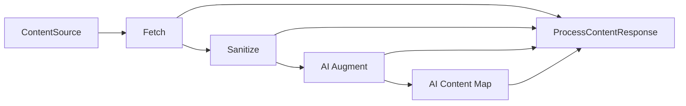

# zmapr Crate Design Specification

## Basic usage

`zmapr` maps local or website content into AI-oriented context through one public workflow function. Callers select stages with options, while stage ordering and artifact handling remain internal.
The function returns a running handle so callers can observe progress, query state, and await completion.

The initial usable workflow is local Fetch with optional Sanitize:

```rust
let handle = process_content(
    ContentSource::local_path("docs"),
    ProcessContentOptions::new("target/zmapr-docs")
        .with_fetch(FetchOptions::default())
        .with_sanitize(SanitizeOptions::default()),
)
.await?;
let output = handle.wait_output().await?;
```

The public entry point is:

```rust
pub async fn process_content(
    source: impl Into<ContentSource>,
    options: ProcessContentOptions,
) -> Result<ProcessContentHandle>;
```

The returned handle keeps progress, completion, and state queries separate:

```rust
impl ProcessContentHandle {
    pub fn take_progress_rx(&mut self) -> Option<ProgressRx>;
    pub async fn wait_output(self) -> Result<ProcessContentOutput>;
    pub fn query(&self) -> ProcessQuery;
}
```

Website Fetch, AI Augment, and AI Content Map are modeled by the public API but remain deferred until their implementations are available.

## Architecture



The workflow executes selected stages in this fixed order. Disabled stages pass the current artifact set through unchanged, except that disabling Fetch requires a valid prior Fetch result.

## Sources

Sources identify where Fetch obtains content:

```rust
pub enum ContentSource {
    LocalPath(LocalContentSource),
    Website(WebsiteContentSource),
}

pub struct LocalContentSource {
    pub path: SPath,
}

pub struct WebsiteContentSource {
    pub url: String,
}
```

Convenience constructors are provided through `ContentSource::local_path` and `ContentSource::website`. Local paths also convert from `SPath`. String-to-source conversion is intentionally not provided because a string could represent either a local path or a URL.

## Workflow options

```rust
pub struct ProcessContentOptions {
    pub destination: SPath,
    pub fetch: Option<FetchOptions>,
    pub sanitize: Option<SanitizeOptions>,
    pub ai_augment: Option<AiAugmentOptions>,
    pub content_map: Option<ContentMapOptions>,
    pub resume: bool,
    pub max_concurrency: usize,
}
```

`ProcessContentOptions::new(destination)` creates an empty workflow. `with_fetch`, `with_sanitize`, `with_ai_augment`, and `with_content_map` enable individual stages without exposing pipeline construction.

An empty workflow is invalid. `max_concurrency` must be greater than zero.

## Stage options

### Fetch

```rust
pub struct FetchOptions {
    pub include: Vec<String>,
    pub exclude: Vec<String>,
    pub copy_local_files: bool,
    pub same_host_only: bool,
    pub max_depth: usize,
    pub follow_links: bool,
}
```

Fetch selects local files or website paths. Include patterns are applied before exclusions, exclusions take precedence, and selected paths are sorted by stable relative path. Local directory traversal is recursive and skips symbolic links.

For local sources, Fetch either copies files below `.zmapr/fetch` or retains their original paths according to `copy_local_files`. It records source-relative paths and stable content hashes.

Website Fetch is planned to crawl from the starting URL, optionally following links while respecting host and depth settings.

### Sanitize

```rust
pub struct SanitizeOptions {
    pub slim_html: bool,
    pub convert_to_markdown: bool,
}
```

Sanitize reads supported UTF-8 text and HTML artifacts, optionally removes nonessential HTML structure, and optionally converts HTML to Markdown. It writes a new artifact set below `.zmapr/stages/sanitize` without changing Fetch artifacts or source files.

Unsupported or non-UTF-8 files are reported as skipped. Item-level transformation failures are retained in the response.

### AI Augment

```rust
pub struct AiAugmentOptions {
    pub provider: String,
    pub model: String,
}
```

AI Augment sends supported current artifacts to the configured provider and model, then writes augmented results below `.zmapr/stages/ai-augment`. Provider and model values must be nonempty.

### AI Content Map

```rust
pub struct ContentMapOptions {
    pub provider: String,
    pub model: String,
    pub journal_path: Option<SPath>,
    pub reuse_unchanged_records: bool,
    pub retain_journal: bool,
}
```

AI Content Map analyzes the latest artifact set and publishes `content-map.json`. It is terminal, so it does not replace the current content artifacts. File and folder analysis can be journaled and reused when source hashes and relevant configuration remain unchanged.

## Internal pipeline

The public function builds a private workflow context and executes internal stages through a shared asynchronous contract:

```rust
trait ProcessingStage {
    fn execute<'a>(
        &'a self,
        context: &'a WorkflowContext,
        input: ArtifactSet,
    ) -> StageFuture<'a>;
}
```

Internal types separate orchestration from public results:

- `WorkflowContext` contains resolved paths, resume settings, and concurrency limits.
- `ArtifactSet` identifies the current artifact root and ordered items.
- `ArtifactItem` stores source identity, relative path, local path, media type, and optional hash.
- `StageOutput` contains the next artifact set and item-level completed, skipped, and failed outcomes.

The pipeline module is private. Callers cannot define custom stages or alter stage ordering.

## Artifact layout

All generated state is rooted at the configured destination:

```text
<destination>/
├── .zmapr/
│   ├── fetch/
│   ├── stages/
│   │   ├── sanitize/
│   │   └── ai-augment/
│   ├── manifest.json
│   └── content-map.journal.jsonl
└── content-map.json
```

Each stage writes to its own location. Prior-stage artifacts remain immutable so downstream failures can be retried without mutating source content or successful upstream work.

## Validation and recovery

Validation occurs before destination mutation or stage execution. It checks:

- At least one stage is enabled.
- Concurrency is nonzero.
- AI stages have nonempty provider and model values.
- Website sources have Fetch enabled.
- Downstream processing without Fetch has a valid existing Fetch cache and manifest.
- Deferred stages return structured `Unsupported` errors.

The manifest records enough source and configuration identity to support resume. The initial resume behavior may reuse only a complete matching Fetch result. Missing, incompatible, or incomplete state is rebuilt rather than treated as reusable.

Durable publication should use deterministic serialization and atomic replacement. Temporary sibling files are written first, then renamed into their final locations.

## Results

`ProcessContentHandle::wait_output` returns the completed workflow data:

```rust
pub struct ProcessContentOutput {
    pub destination: SPath,
    pub manifest_path: Option<SPath>,
    pub content_root: SPath,
    pub content_map_path: Option<SPath>,
    pub completed_items: Vec<ProcessItem>,
    pub skipped_items: Vec<ProcessItem>,
    pub failures: Vec<ProcessFailure>,
}

pub struct ProcessItem {
    pub source: String,
    pub output_path: Option<SPath>,
    pub stage: ProcessStage,
}

pub struct ProcessFailure {
    pub item: ProcessItem,
    pub message: String,
}
```

`ProcessItem` identifies successful or skipped work. `ProcessFailure` preserves item-level errors without hiding successful work from the same stage.

## Content-map contract

```rust
pub struct ContentMap {
    pub file_map: BTreeMap<String, FileMapEntry>,
    pub folder_map: BTreeMap<String, FolderMapEntry>,
}

pub struct FileMapEntry {
    pub summary: String,
    pub when_to_use: String,
    pub public_types: Vec<String>,
    pub public_functions: Vec<String>,
    pub topics: Vec<String>,
}

pub struct FolderMapEntry {
    pub summary: String,
    pub when_to_use: String,
    pub topics: Vec<String>,
}
```

The serialized map uses `file_map` and `folder_map`. Folder entries intentionally do not include code-specific public type or function fields.

## Errors

The crate exposes one `Result<T>` alias and a structured `Error` enum. Process failures distinguish:

- `InvalidConfiguration`, for incompatible options or sources.
- `Unsupported`, for modeled but unimplemented functionality.
- `InvalidCache`, for missing or invalid prior artifacts.
- `MalformedState`, for missing or invalid durable workflow state.

External I/O and HTTP failures are represented by dedicated error variants. Production paths do not panic for expected workflow failures.

## Implementation scope

The first complete vertical slice is:

- Local file and recursive directory Fetch.
- Symbolic-link skipping.
- Deterministic include and exclude selection.
- Optional copying into the Fetch cache.
- Stable source hashes.
- Optional UTF-8 text and HTML Sanitize.
- Fetch-only and Fetch-plus-Sanitize responses.
- Structured errors for Website Fetch and both AI stages.

The public contracts for Website Fetch, AI Augment, AI Content Map, manifests, journals, and complete resume behavior are established before their full execution is implemented.

## Module boundaries

The crate root reexports the public error and process APIs. The `process` module owns public workflow types and privately contains pipeline implementation details:

```text
src/
├── lib.rs
├── error.rs
├── process/
│   ├── mod.rs
│   ├── map.rs
│   ├── options.rs
│   ├── pipeline.rs
│   ├── process_impl.rs
│   ├── response.rs
│   └── source.rs
└── webc/
```

Public models remain focused in their own files. Internal stage contracts stay private so the high-level workflow remains stable while stage implementations evolve.

